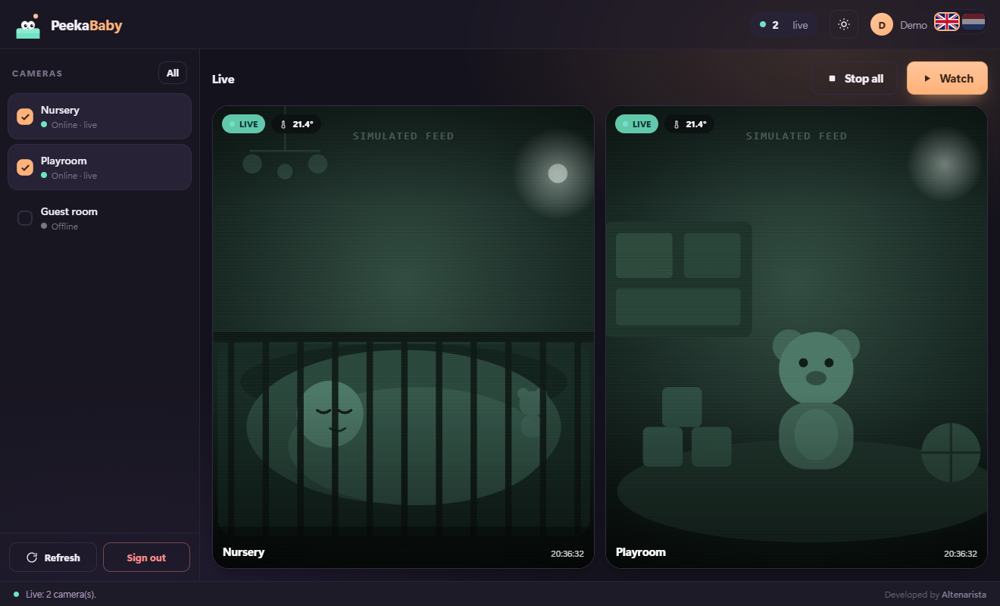
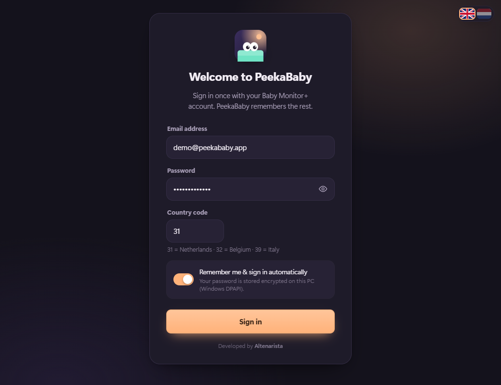
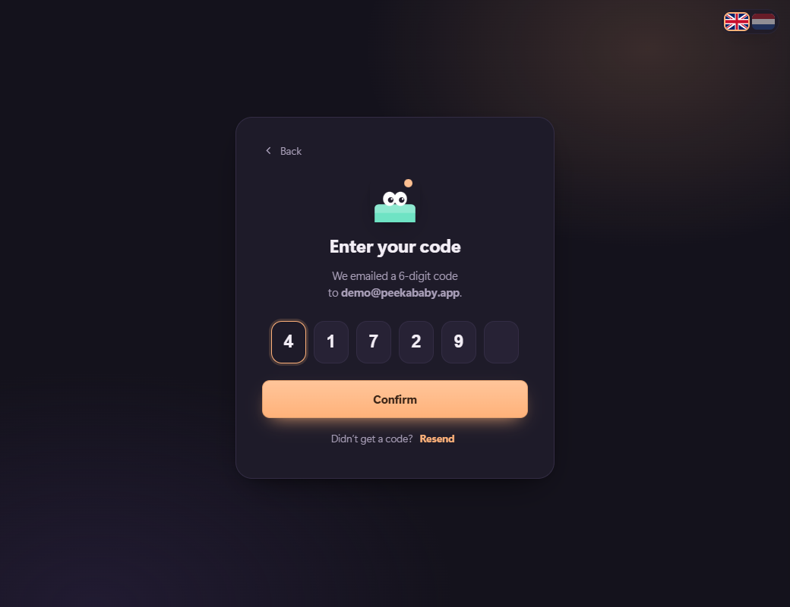
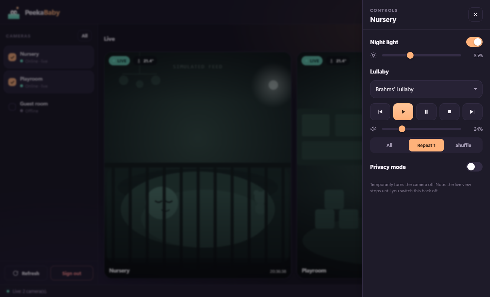

<h1 align="center">👶 PeekaBaby</h1>

<p align="center">
  <b>Watch your Philips Avent baby monitor cameras on your Windows PC.</b><br>
  Multiple cameras at once · live video inside the app · one login, remembered · no VLC, no Home Assistant, no Python.
</p>

<p align="center">🇬🇧 English · <a href="README.nl.md">🇳🇱 Nederlands</a></p>

<p align="center">
  
</p>
<p align="center"><sub>⚠️ Every screenshot on this page uses <b>demo data</b>: a made-up account and a simulated camera image. No real footage.</sub></p>

---

PeekaBaby is a cosy, single-file Windows app that connects to the Philips Avent
("Baby Monitor+") cloud and streams your nursery cameras straight to your
desktop — with in-app controls for the night light, lullabies and volume.

It talks to the same reverse-engineered Tuya API as
[`thekoma/aventproxy`](https://github.com/thekoma/aventproxy), but packages
everything into one friendly executable: a WebRTC→RTSP bridge, a
[go2rtc](https://github.com/AlexxIT/go2rtc) media server and a modern WebView2
UI, all inside `PeekaBaby.exe`.

## Features

- 🎥 **All your cameras, live, in one window** — 1 camera fills the screen, more
  cameras grow the grid automatically. Pop any camera out into its own
  always-on-top mini window.
- 🔐 **Log in once** — email + password + the 6-digit email code. PeekaBaby then
  remembers everything and re-authenticates itself when the session expires
  (usually without a new code, because your device stays trusted). Your
  password is stored **encrypted with Windows DPAPI** — only your Windows
  account can read it.
- 🌙 **In-app controls** — night light on/off + brightness, lullaby track (15
  built-in tracks/sounds), play / pause / next / previous, volume and play mode.
- 🎨 **Modern, calming UI** — dark "night" theme by default (with a light theme),
  smooth animations, mute per camera.
- 📦 **Truly self-contained** — one `.exe`. No VLC, no Python install, no Docker,
  no Home Assistant. Uses the Microsoft Edge **WebView2** runtime that ships
  with Windows 10/11.

## Screenshots

| Sign in once | The 6-digit email code |
| --- | --- |
|  |  |

**Night light, lullabies & volume — without reaching for your phone:**

<p align="center">
  
</p>

## Install & run

1. Download **`PeekaBaby.exe`** (from the [Releases](../../releases) page).
2. Double-click it.
3. Sign in with your **Baby Monitor+** email, password and country code
   (`31` = NL, `32` = BE, `39` = IT). Enter the 6-digit code from your email.
4. Tick the camera(s) you want and click **Watch**. 🎉

Next time it opens straight to your cameras — no sign-in needed.

> **Windows only.** Requires the Edge WebView2 runtime (pre-installed on
> Windows 11 and most Windows 10 machines; otherwise a free download from
> Microsoft).

## Build from source

Requires Python 3.11+ and the Go bridge + go2rtc binaries in place
(`repo/avent-webrtc-bridge/avent-webrtc-bridge.exe`, `bin/go2rtc.exe`).

```bash
python -m venv .venv
.venv\Scripts\pip install requests pycryptodome pywebview pyinstaller

.venv\Scripts\python -m PyInstaller --noconfirm --onefile --windowed --name PeekaBaby ^
  --collect-all webview --collect-all pythonnet --hidden-import clr --hidden-import babyfoon_app ^
  --add-data "ui/index.html;ui" ^
  --add-data "bin/go2rtc.exe;bin" ^
  --add-data "repo/avent-webrtc-bridge/avent-webrtc-bridge.exe;repo/avent-webrtc-bridge" ^
  peekababy.py
```

Run in dev (with a console + logs + devtools) via `debug-peekababy.cmd`.

### How it works

```
Philips Avent cloud ──▶ avent-webrtc-bridge (WebRTC→RTSP) ──▶ go2rtc (RTSP→WebRTC) ──▶ WebView2 <video>
```

`peekababy.py` is the app shell (WebView2 via pywebview) and the Tuya client;
`ui/index.html` is the interface; `babyfoon_app.py` holds the shared login /
discovery logic.

## Security & privacy

- Runs **entirely on your machine**; video never leaves your local network
  except the encrypted connection to Philips' own cloud (same as the phone app).
- Your password lives only in `babyfoon_config.json`, **DPAPI-encrypted** to your
  Windows account. The session and camera list stay local too.
- The included `.gitignore` keeps `babyfoon_config.json`, `avent_creds.json`,
  `.tuya-data/` and the logs out of git — **never commit those.**

## Credits & licenses

- Camera protocol & Go bridge: [`thekoma/aventproxy`](https://github.com/thekoma/aventproxy)
- Media server: [`AlexxIT/go2rtc`](https://github.com/AlexxIT/go2rtc) (MIT)
- PeekaBaby app code: MIT — see [LICENSE](LICENSE).

Not affiliated with or endorsed by Philips or Tuya. "Philips Avent" is a
trademark of its owner.
