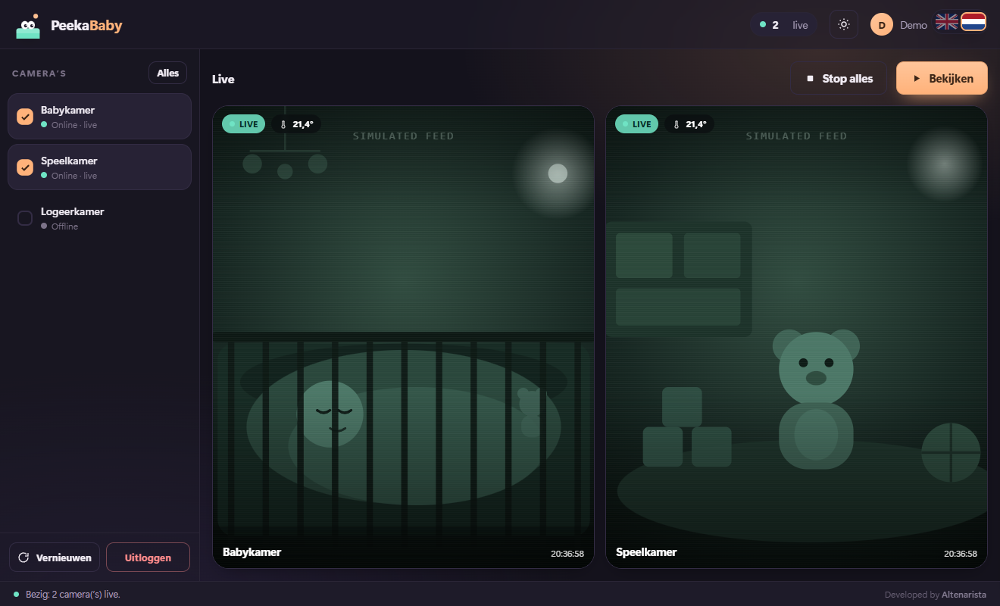
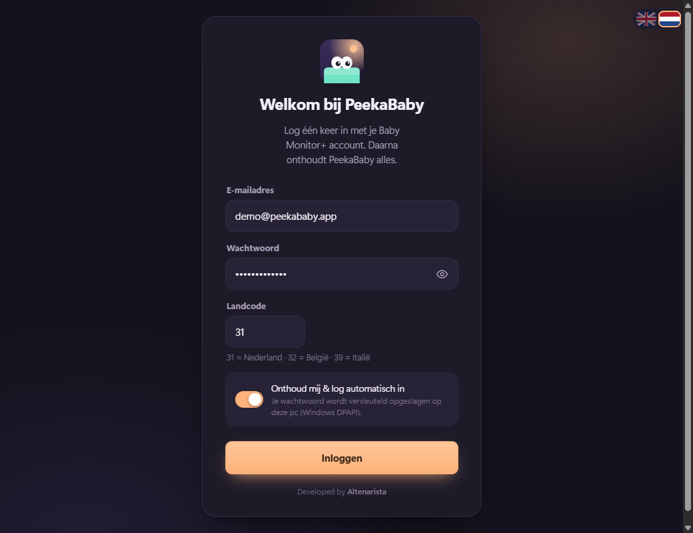
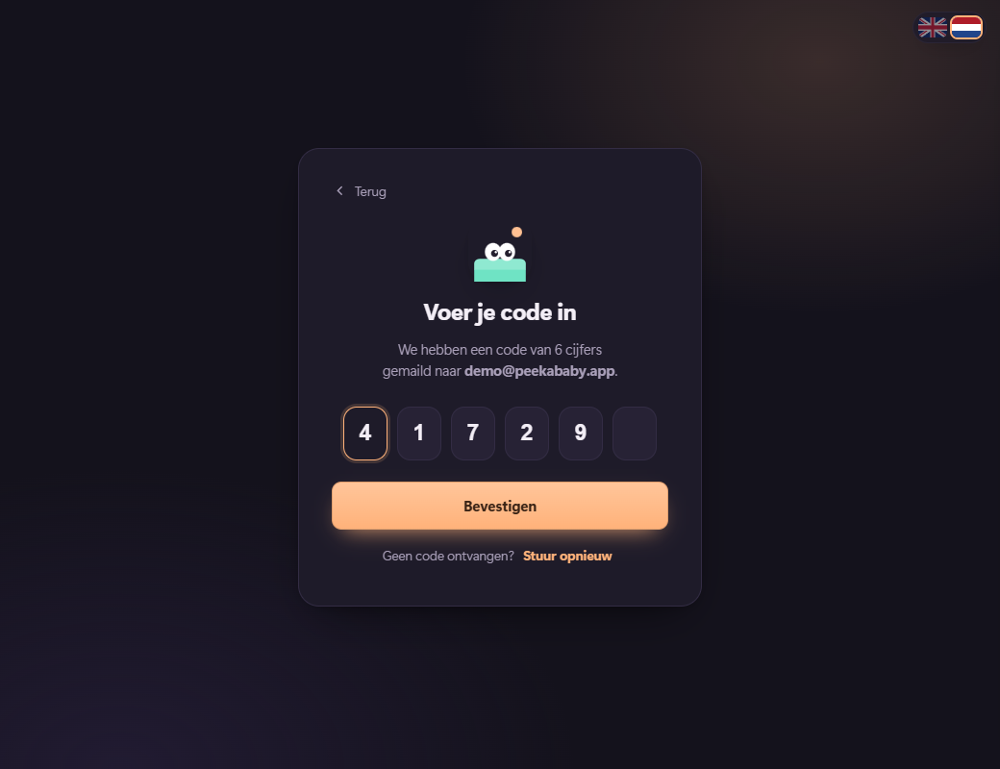
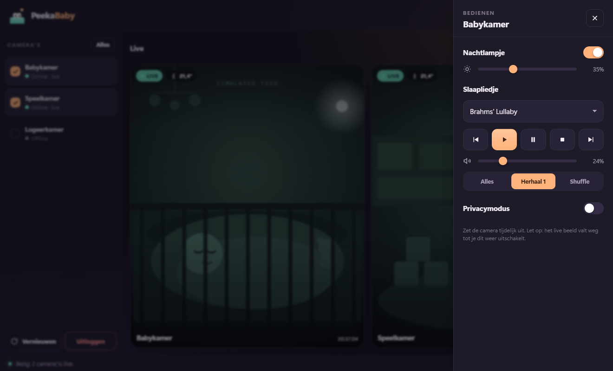

<h1 align="center">👶 PeekaBaby</h1>

<p align="center">
  <b>Bekijk je Philips Avent babyfoon-camera's op je Windows-pc.</b><br>
  Meerdere camera's tegelijk · live beeld ín de app · één keer inloggen, onthouden · geen VLC, geen Home Assistant, geen Python.
</p>

<p align="center"><a href="README.md">🇬🇧 English</a> · 🇳🇱 Nederlands</p>

<p align="center">
  
</p>
<p align="center"><sub>⚠️ Alle screenshots op deze pagina gebruiken <b>demogegevens</b>: een verzonnen account en een nagebootst camerabeeld. Geen echte beelden.</sub></p>

---

PeekaBaby is een knusse Windows-app-in-één-bestand die verbindt met de Philips
Avent ("Baby Monitor+") cloud en je babykamer-camera's rechtstreeks naar je
bureaublad streamt — met bediening voor het nachtlampje, slaapliedjes en volume.

Het praat met dezelfde reverse-engineerde Tuya-API als
[`thekoma/aventproxy`](https://github.com/thekoma/aventproxy), maar verpakt alles
in één vriendelijke .exe: een WebRTC→RTSP-bridge, een
[go2rtc](https://github.com/AlexxIT/go2rtc) mediaserver en een moderne
WebView2-interface, allemaal in `PeekaBaby.exe`.

## Functies

- 🎥 **Al je camera's live in één venster** — 1 camera vult het beeld, meer
  camera's laten het raster automatisch meegroeien. Klik een camera uit naar een
  eigen altijd-bovenop mini-venster.
- 🔐 **Eén keer inloggen** — e-mail + wachtwoord + de 6-cijferige e-mailcode.
  PeekaBaby onthoudt daarna alles en logt zichzelf opnieuw in als de sessie
  verloopt (meestal zonder nieuwe code, omdat je apparaat vertrouwd blijft). Je
  wachtwoord wordt **versleuteld opgeslagen met Windows DPAPI** — alleen jouw
  Windows-account kan het lezen.
- 🌙 **Bediening in de app** — nachtlampje aan/uit + helderheid, slaapliedje
  (15 nummers/geluiden), afspelen / pauze / volgende / vorige, volume en
  afspeelmodus.
- 🎨 **Moderne, rustige interface** — donker "nacht"-thema als standaard (met
  licht thema), vloeiende animaties, per camera dempen, en een taalschakelaar
  (Engels/Nederlands).
- 📦 **Echt zelfstandig** — één `.exe`. Geen VLC, geen Python-installatie, geen
  Docker, geen Home Assistant. Gebruikt de Microsoft Edge **WebView2**-runtime
  die op Windows 10/11 standaard aanwezig is.

## Screenshots

| Eén keer inloggen | De 6-cijferige e-mailcode |
| --- | --- |
|  |  |

**Nachtlampje, slaapliedjes & volume — zonder je telefoon erbij te pakken:**

<p align="center">
  
</p>

## Installeren & starten

1. Download **`PeekaBaby.exe`** (via de [Releases](../../releases)-pagina).
2. Dubbelklik het.
3. Log in met je **Baby Monitor+** e-mail, wachtwoord en landcode
   (`31` = NL, `32` = BE, `39` = IT). Voer de 6-cijferige code uit je e-mail in.
4. Vink de camera('s) aan en klik **Bekijken**. 🎉

De volgende keer opent hij meteen op je camera's — geen opnieuw inloggen nodig.

> **Alleen Windows.** Vereist de Edge WebView2-runtime (vooraf geïnstalleerd op
> Windows 11 en de meeste Windows 10-pc's; anders een gratis download van
> Microsoft).

## Zelf bouwen

Vereist Python 3.11+ en de Go-bridge + go2rtc-binaries op hun plek
(`repo/avent-webrtc-bridge/avent-webrtc-bridge.exe`, `bin/go2rtc.exe`).

```bash
python -m venv .venv
.venv\Scripts\pip install requests pycryptodome pywebview pyinstaller

.venv\Scripts\python -m PyInstaller --noconfirm --onefile --windowed --name PeekaBaby ^
  --collect-all webview --collect-all pythonnet --hidden-import clr --hidden-import babyfoon_app ^
  --add-data "ui/index.html;ui" ^
  --add-data "bin/go2rtc.exe;bin" ^
  --add-data "repo/avent-webrtc-bridge/avent-webrtc-bridge.exe;repo/avent-webrtc-bridge" ^
  peekababy.py
```

Draai tijdens ontwikkelen (met console + logs + devtools) via `debug-peekababy.cmd`.

### Hoe het werkt

```
Philips Avent cloud ──▶ avent-webrtc-bridge (WebRTC→RTSP) ──▶ go2rtc (RTSP→WebRTC) ──▶ WebView2 <video>
```

`peekababy.py` is de app-schil (WebView2 via pywebview) en de Tuya-client;
`ui/index.html` is de interface; `babyfoon_app.py` bevat de gedeelde login- en
ontdekkingslogica.

## Veiligheid & privacy

- Draait **volledig op je eigen pc**; video verlaat je lokale netwerk niet,
  behalve de versleutelde verbinding met de Philips-cloud (net als de telefoon-app).
- Je wachtwoord staat alleen in `babyfoon_config.json`, **DPAPI-versleuteld** voor
  je Windows-account. De sessie en cameralijst blijven ook lokaal.
- De meegeleverde `.gitignore` houdt `babyfoon_config.json`, `avent_creds.json`,
  `.tuya-data/` en de logs buiten git — **commit die nooit.**

## Met dank aan & licenties

- Cameraprotocol & Go-bridge: [`thekoma/aventproxy`](https://github.com/thekoma/aventproxy)
- Mediaserver: [`AlexxIT/go2rtc`](https://github.com/AlexxIT/go2rtc) (MIT)
- PeekaBaby app-code: MIT — zie [LICENSE](LICENSE).

Niet gelieerd aan of goedgekeurd door Philips of Tuya. "Philips Avent" is een
handelsmerk van de eigenaar.
